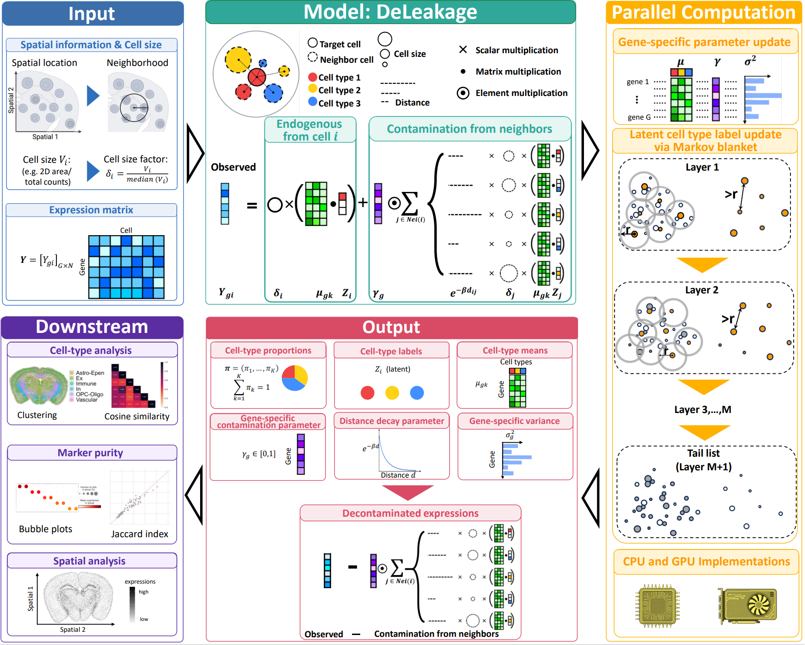

# DeLeakage

We are excited to release DeLeakage v1.0! To install, please follow the instructions in our [install page](install.md). Try our interactive demo [here](quickstart.md).

<p align="center">
  
</p>

## Overview

Spatial transcriptomics (ST) technologies have revolutionized our understanding of tissue organization, but they suffer from a **prevalent transcript leakage problem**: transcripts expressed by one cell diffuse to neighboring cells and are incorrectly detected as endogenous expression. This issue affects all major imaging-based and sequencing-based platforms, across multiple tissues and species, leading to inaccurate expression quantification, biased cell-type annotation, and false detection of spatially dependent gene expression.

To tackle this problem, we propose a **reference-free Bayesian hierarchical model-based method**, **DeLeakage** (**De**contamination for Transcript **Leakage**), which decomposes the observed transcript counts of each cell into its endogenous expression and transcripts leaked from other cells through a diffusion process. Our model includes **gene-specific diffusion parameters** to capture the distinct leakage properties of different transcripts, a critical feature missing from conventional deconvolution and denoising methods.

## Key Features

- **Platform-agnostic**: Works with all major spatial transcriptomics technologies (MERFISH, Xenium, Pixel-seq, and more)
- **Reference-free**: No external scRNA-seq reference required, avoiding batch effects and missing cell type issues
- **Gene-specific correction**: Models distinct diffusion rates for individual genes, matching biological reality
- **Theoretically guaranteed**: Proven model identifiability under easily satisfied conditions
- **Highly scalable**: GPU-accelerated parallel MCMC algorithm processes 4 million cells in ~1 hour
- **Downstream improvement**: Significantly enhances cell-type annotation accuracy and reduces false positives in differential expression analysis

## Performance Highlights

DeLeakage substantially outperforms existing ST denoising methods (SPLIT, SpotClean) on both simulated and real data:

- Reduces co-detection of mutually exclusive cell-type markers by **70-80%**
- Improves Adjusted Rand Index (ARI) for cell-type clustering by **71.7%**
- Eliminates false spatial auto-correlation signals caused by transcript leakage
- Preserves true endogenous expression levels while effectively removing contamination

## Supported Data Types

- Imaging-based ST: MERFISH, Xenium, seqFISH, smFISH
- Sequencing-based ST: Pixel-seq, Slide-seq, Visium (high-resolution)
- Species: Human, mouse, and other model organisms
- Tissues: Brain, heart, and all other tissue types

## Quick Start

See our [install page](install.md) and [quickstart](quickstart.md) for detailed tutorials and advanced usage.

## Citation

Once our bioRxiv paper is available, please cite our work as shown below:
```
Christina Huan Shi1,*, Yibo Zhai2,*, Savio Ho-Chit Chow1, Liangbang Li2, Chase M. Carver3, Marcos G. Teneche4, Jesus Flores5, Colin Kern5, Peter D. Adams4,6, Bing Ren7, Marissa J. Schafer3, Quan Zhu5, Yingying Wei2,$ and Kevin Y. Yip1,4,8,$. Correcting spatial transcriptomics data affected by a prevalent transcript leakage problem across platforms, species, and tissues. bioRxiv. https://xxxx
(* equal contributions; $ co-corresponding authors)
```

## Author Affiliations
1. Center for Data Science and Artificial Intelligence, Sanford Burnham Prebys Medical Discovery Institute, La Jolla, CA, United States
2. Department of Statistics and Data Science, The Chinese University of Hong Kong, Shatin, Hong Kong
3. Robert and Arlene Kogod Center on Aging, Department of Physiology and Biomedical Engineering, Mayo Clinic, Rochester, MN, United States
4. Cancer Genome and Epigenetics Program, NCI-Designated Cancer Center, Sanford Burnham Prebys Medical Discovery Institute, La Jolla, CA, United States
5. Department of Cellular and Molecular Medicine, University of California San Diego, San Diego, CA, United States
6. Center for Metabolic and Liver Diseases, Sanford Burnham Prebys Medical Discovery Institute, La Jolla, CA, United States
7. New York Genome Center, New York, NY, United States
8. Center for Neurologic Diseases, Sanford Burnham Prebys Medical Discovery Institute, La Jolla, CA, United States

## Code & Data

- Source code: [https://github.com/Yip-Lab/DeLeakage](https://github.com/Yip-Lab/DeLeakage)
- Analysis code: [https://github.com/Yip-Lab/DeLeakage-analysis](https://github.com/Yip-Lab/DeLeakage-analysis)

## License

Copyright (c) 2026 DeLeakage authors

Permission is hereby granted, free of charge, to any person obtaining a copy of this software and associated documentation files (the "Software"), to deal in the Software without restriction, including without limitation the rights to use, copy, modify, merge, publish, distribute, sublicense, and/or sell copies of the Software, and to permit persons to whom the Software is furnished to do so, subject to the following conditions:

The above copyright notice and this permission notice shall be included in all copies or substantial portions of the Software.

THE SOFTWARE IS PROVIDED "AS IS", WITHOUT WARRANTY OF ANY KIND, EXPRESS OR IMPLIED, INCLUDING BUT NOT LIMITED TO THE WARRANTIES OF MERCHANTABILITY, FITNESS FOR A PARTICULAR PURPOSE AND NONINFRINGEMENT. IN NO EVENT SHALL THE AUTHORS OR COPYRIGHT HOLDERS BE LIABLE FOR ANY CLAIM, DAMAGES OR OTHER LIABILITY, WHETHER IN AN ACTION OF CONTRACT, TORT OR OTHERWISE, ARISING FROM, OUT OF OR IN CONNECTION WITH THE SOFTWARE OR THE USE OR OTHER DEALINGS IN THE SOFTWARE.
